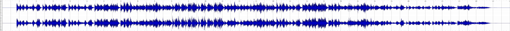
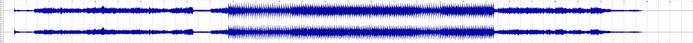

### Introduction

The AI is always confident and thinks it knows everything. I'm so sick of this. Hey AI, have you ever figured out the difference between traditional Chinese music and traditional Japanese music? Or are you just generalizing and lumping all oriental music together? I don't believe in your boasting, then let's prove with data whether you AI is pretending to know or not.

I used artificial intelligence to create music and opted for Stable Audio to explore how well Al can distinguish between the styles of Chinese and Japanese music.
For my first composition, l input prompts such as Drum Kit, Flowing, Raw, Epic, Chinese Traditional Music, and Sentimental.
The outcome was this piece: stableaudio.com/1/share/60e8141d-6ac9-4928-8bf2-0d6d6e420736. 
For my second composition, I used prompts that included Drum Kit, Flowing, Raw, Epic, Japanese Traditional Music, and Sentimental, which resulted in this track: https:// stableaudio.com/1/share/c8d896b9-e6ba-4646-a3bc-c81682f47011.


I had Sonic Visualizer automatically visualize the two pieces of music, which made it easy for me to compare their differences.


------------------------------------------------------------------------

### Visualization

```{r}








```


library(ggplot2) library(plotly)

p <- ggplot(mtcars, aes(x = hp, y = mpg)) + geom_point()

ggplotly(p)


```{r, echo=TRUE}


library(ggplot2) 
library(plotly)

p <- ggplot(mtcars, aes(x = hp, y = mpg)) + geom_point()

ggplotly(p)


library(ggplot2)
library(plotly)

p <- ggplot(mtcars, aes(x = hp, y = mpg)) + 
  geom_point()

ggplotly(p)


```


------------------------------------------------------------------------

### Discussion
