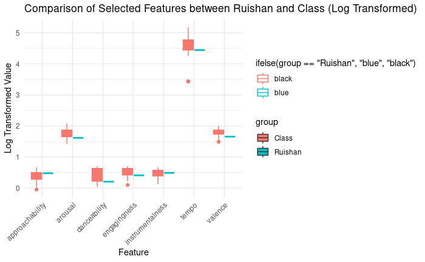

### Background


This is Chinese track

<div>
  <audio controls>
    <source src="ruishan-h-1.mp3" type="audio/mpeg">
    Your browser does not support the audio element.
  </audio>
</div>

This is Japanese track

<div>
  <audio controls>
    <source src="ruishan-h-2.mp3" type="audio/mpeg">
    Your browser does not support the audio element.
  </audio>
</div>


------------------------------------------------------------------------

### Track-level features

```{r}





```
As an Asian student, I have a strong appreciation for Chinese and Japanese music. 
However, I lack a formal music background, which makes it challenging for me to create my own compositions. 
To overcome this, I turned to artificial intelligence for assistance and decided to try out Stable Audio. 
For my first composition, I input prompts such as Drum Kit, Flowing, Raw, Epic, Chinese Traditional Music, and Sentimental. 
The outcome was this piece: https://stableaudio.com/1/share/60e8141d-6ac9-4928-8bf2-0d6d6e420736.
For my second composition, I used prompts that included Drum Kit, Flowing, Raw, Epic, Japanese Traditional Music, and Sentimental, 
which resulted in this track: https://stableaudio.com/1/share/c8d896b9-e6ba-4646-a3bc-c81682f47011.

This box plot compares the musical characteristics of the two pieces of audio I generated with the class corpus, 
and shows that the Chinese and Japanese music I produced using AI is very different for the class corpus. 
Interestingly, except for approachability and instrumentality, the music I produced was almost equal to the class minimum value for 
arousal, danceability,engagingness,tempo, and valence, suggesting that the music has a slow tempo, is seriously soothing, 
and sentimental. Asian drum music is quite different from the overall fast-paced, danceable, and inspiring music of the class corpus. 
However, this is only an overall comparison, and I hope to find more commonalities in the detailed comparisons to come.
```{r, echo=TRUE}


```


------------------------------------------------------------------------

### Chroma features [pitch]


```{r}

library(tidyverse)
source("compmus.R")

"features/ruishan-h-1.json" |>                           # Change the track
  compmus_chroma(norm = "identity") |>                 # Change the norm
  ggplot(aes(x = time, y = pc, fill = value)) + 
  geom_raster() +
  scale_y_continuous(
    breaks = 0:11,
    minor_breaks = NULL,
    labels = c(
                "C", "C#|Db", "D", "D#|Eb",
                "E", "F", "F#|Gb", "G",
                "G#|Ab", "A", "A#|Bb", "B"
              )
  ) +
  scale_fill_viridis_c(guide = "none") +               # Change the colours?
  labs(x = "Time (s)", y = NULL, fill = NULL) +
  theme_classic()                                      # Change the theme?


```


`


```

------------------------------------------------------------------------

hello

### Loudness [volume]


```{r}


"features/ruishan-h-2.json" |>                           # Change the track
  compmus_chroma(norm = "identity") |>                 # Change the norm
  ggplot(aes(x = time, y = pc, fill = value)) + 
  geom_raster() +
  scale_y_continuous(
    breaks = 0:11,
    minor_breaks = NULL,
    labels = c(
                "C", "C#|Db", "D", "D#|Eb",
                "E", "F", "F#|Gb", "G",
                "G#|Ab", "A", "A#|Bb", "B"
              )
  ) +
  scale_fill_viridis_c(guide = "none") +               # Change the colours?
  labs(x = "Time (s)", y = NULL, fill = NULL) +
  theme_classic()                                      # Change the theme?


```


------------------------------------------------------------------------

### Timbre features [timbre]


------------------------------------------------------------------------

### Temporal features [duration]


------------------------------------------------------------------------

### Clustering


------------------------------------------------------------------------

### Contribution