Intro Page
==================================================
### Background and Research Questions

For people without any basic knowledge of programming or artificial intelligence, interacting with an AI is a magical thing in itself, 
and these people often have no way of recognizing the quality of the content generated by the AI, and take it all as correct and unquestionable. 
This phenomenon maybe due to the fact that the AI seems to be so obedient that no matter what complex or even absurd commands people type into the AI, 
the AI is able to try and type in a piece of content that seems to make sense. 
But while people get text, images, or audio generated by the AI too easily, 
they overlook the question of whether the content generated by the AI actually meets the requirements, rather than being a pile of empty nonsense that seems to be correct. 
That is to say, does the AI generated content really conform to the input prompts entered by the user? 
If the AI generated audio does not meet the user's requirements, how can the user recognize it?

In this portfolio, I will answer two research questions:
The first is whether AI-generated music actually meets the input prompts.
The second is which music visualization methods can help me identify whether AI-generated audio meets the input prompts.

As an Asian student, I have a strong appreciation for Chinese and Japanese music. 
However, I lack a formal music background, which makes it challenging for me to create my own compositions. 
To overcome this, I turned to artificial intelligence for assistance by using Stable Audio as the AI tool to generate music. 

First, I input prompts including Drum Kit, Flowing, Raw, Epic, Chinese Traditional Music, and Sentimental. 
The outcome is this piece: https://stableaudio.com/1/share/60e8141d-6ac9-4928-8bf2-0d6d6e420736.

This is the audio of the AI generated Chinese music track:

  <audio controls>
    <source src="ruishan-h-1.mp3" type="audio/mpeg">
    Your browser does not support the audio element.
  </audio>

Furthermore, I use prompts that included Drum Kit, Flowing, Raw, Epic, Japanese Traditional Music, and Sentimental, 
which resulted in this track: https://stableaudio.com/1/share/c8d896b9-e6ba-4646-a3bc-c81682f47011.

This is the audio of the AI generated Japanese music track:

  <audio controls>
    <source src="ruishan-h-2.mp3" type="audio/mpeg">
    Your browser does not support the audio element.
  </audio>

Track-level features
====================================================================

Column
-------------------------------------------------------------------

### Track-level features

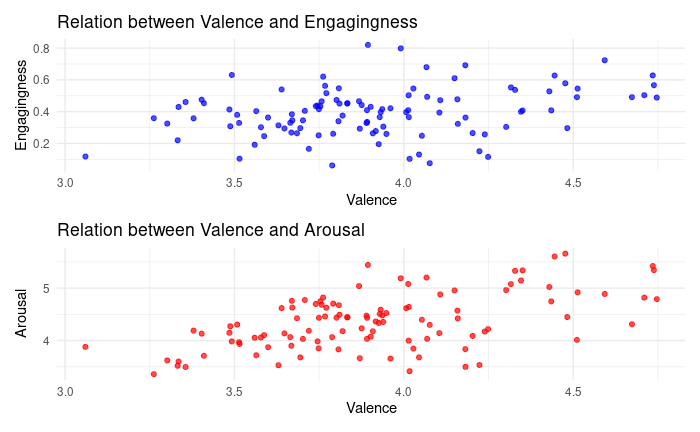

Column
-----------------------------------------------------------------

In this page I will answer two questions: In music-track levels, how to recognize if the music generated by AI matches the input prompts?

Another question is: If the music generated by the AI does not match the input prompts, what are the possible reasons?

My answer is that the AI does not understand the cultural context of the user's input prompts, and therefore some of the music-track level features in the generated audio do not match the features implied by the user's input prompts. To prove this, I will quantify the music-track level features and then comparing the values of the features implied by the user input prompts with the values of the features in the AI-generated music. If the input prompts imply high values and the AI-generated music has low values, then the requirement is not met.

In order to create my musical tracks, I use the prompts including Drum Kit, Epic, Chinese/Japanese Traditional Music, and Sentimental. Understanding this prompts requires an understanding of Asian drum culture. According to Yan and Pu (1997), in traditional Chinese and Japanese music, the drum symbolizes the king, the drummer is usually the general, and the listener of the drums is the common soldier. The Drum Kit with its epic feel is mainly used to boost morale on the battlefield, calling on the army to fight hard and do their loyalty for the emperor.

Therefore, the sentimental under the epic context means a rather complex emotion, instead of mere sadness.
The sentimentality is the combine of a sadness for the invasion of the country, the victimization of family members, and resentment towards the enemy, according to Yan and Pu (1997). As a result, Drum Kit, Epic, Chinese and Japanese Traditional Music, and Sentimental means the music track has low valence but high engagingness and high arousal. In other words, these four prompts aims to create a drum music which reminds the soldiers that their family and kids are suffering due to the brutal enemy (which represents grieved, low valence)and stimulate the soldiers to have the courage or even anger (which represents high arousal and engagingness ) to fight with the enemy in battlefield.

However, the AI generated Chinese and Japanese drum music do not meet my requirements. In the AI generated Chinese music tracks, the arousal is 3.7, the engagingness is 0.45, and the valence 3.4.
In the AI generated Japanese music, the arousal is 3.8, the engagingness is 0.36, and the valence is 3.6.

Firstly, low valence 3.4 and 3.6 means sad or grieved, which meets my prompt Sentimental. However the engagingness and arousal in both music tracks are all in low value, which is the contrast of my expectations: high value of engagingness and arousal. Therefore, the AI generated two music tracks fail to meet my requirements.

The class corpus I used consisted of mostly Western music, as I was the only one in the corpus who chose to use AI to generate a piece of traditional Asian music, while the other students created Western music of varying styles either manually or with AI. In the scatterplot illustrates the relationship between valence and engagingness in the class corpus , as well as the relationship between valence and arousal.

Next, by calculating Spearman's Rank Order Correlation using R studio, the rho of valence with engagingness is 0.2866772, p-value is 0.00263, which means that valence has a statistically significant weak positive correlation with engagingness has a statistically significant weak positive correlation.Moreover, the rho of valence with arousal is 0.4897705, p-value is 7.469e-08, which means valence has a statistically significant positive correlation with arousal. In other words, the greater the valence, the greater the engagingness and arousal of the music track. This suggests that the more emotionally pleasing the music track is, the more inspiring and motivating it will be, and the more people will have the urge to participate in the music. The opposite is true for sadder music.

Since there are only 108 music tracks in the corpus, this small amount of data is not enough to generalize the overall pattern of Western music, but at least in this corpus, high valence shows a statistically significant positive correlation with engagingness and arousal in music created by students from the West.

This finding helps me to speculate why the AI generated Chinese and Japanese drum music do not meet my requirements: if the music used to train the AI is mainly western music, then the AI will be more familiar with the statistically significant positive correlation between high valence and engagingness and arousal. By contrast, probably AI is not familiar with a traditional music convention in Asian drum music which is merely a cultural habit long long ago without statistical significance.

Therefore, it is not easy for AI to generate a piece of music with low valence and high engagingness and arousal, and it may be necessary for the user to give more hints in the prompt, or to directly ask the AI to generate a piece of music with low valence and high engagingness and arousal. However, this is difficult for Asian users who do not have a basic knowledge of music, or even do not speak English, and even the overly specialized prompts do not match the goals of AI music generation tool to easily generate a piece of music without musical background.

Limitation

I must admit that I have a very subjective opinion that the class corpus is made up of Western music. The only evidence for this judgment is that I don't think any of the songs in the corpus, except for my own, sound like Asian music, even though I don't really even know much about Chinese music. This overly subjective judgment is due to my laziness: I didn't reach out to my classmates and ask them directly: did you generate Western or Eastern music, so I have no objective evidence of what music they actually generated. 

Reference 

Yan, C., & Pu, H. (1997). Zhongguo Guwenhua Yanjiu [Research on Chinese Drum Culture]. Guangxi Education Press.

Chroma Features
================================================================

Column
----------------------------------------------------------------
### Chroma features [pitch]

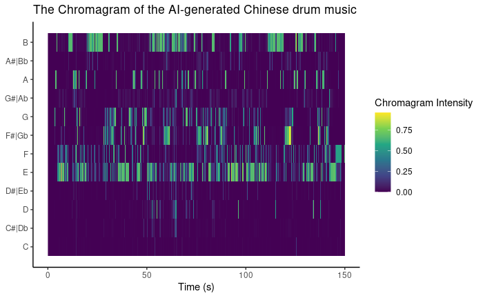
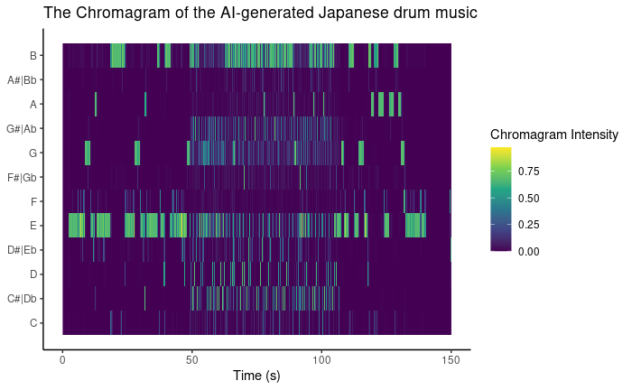

Column
----------------------------------------------------------------
As discussed on the previous page, one can rely on quantifying the music-track level feature to determine whether AI-generated music meets user requirements. This approach is very convenient because both traditional and modern music can be judged in this way. However, because of this, the method in the previous page has no way to answer the question: did the AI really generate traditional Chinese music according to my requirements in the prompts? In other words, does the AI know the significant differences between traditional Chinese music and modern music?
Since Quantifying features is not enough to answer this question, in this page I will try to answer this question by looking at the Chromagram. The reason is that Pitch classes, or notes, can be clearly and easily observed in the Chromagram. According to Gong (1995), traditional Chinese music uses the Chinese Five Tone Modes which includes the five pitch classes CDEGA, while F and B are missing. Chinese Five Tone Modes were later introduced to Japan, thus Japanese traditional music, especially folk songs, also use Five Tone Modes which includes ABCEF while D and G are missing, according to Gong (1995).

Therefore, if F and B appear in AI generated Chinese music, then the AI generated music is not traditional Chinese music. Similarly, if D and G appear in AI generated Japanese music, then the AI generated music is not traditional Japanese music. By looking at the Chromagram, it is easy to see if these pitch classes exist.

In the Chromagram of the AI-generated Chinese drum music, the pitch class C has the lowest value which is between 0 and 0.25, which means the pitch class C did not show up in this music track. This does not conform to the Chinese Five Tone Modes in traditional Chinese music in which the pitch class C is frequently used. Moreover, in this Chromagram, the pitch class B has rather high value which is between 0.50 and 0.75. This means that the pitch class B has been played in this music track. This also does not conform to the Chinese Five Tone Modes in traditional Chinese music in which the pitch class B is never used. Therefore, the violation the Chinese Five Tone Modes such as the missing C and the high value of B means that this AI generated Chinese music is not traditional Chinese music.

Furthermore, in the Chromagram of the AI-generated Japanese drum music, the pitch class C also has low value which means C is missing in this music track and the G has some high value which means G has been played. This also violates the Five Tone Modes in Japanese traditional music. This means that this AI generated Japanese music is also not traditional Japanese music. 

It is interesting to find that in both Chinese and Japanese music, AI choose to not play the pitch class C which is frequently used in western music such as in the C major and C minor. I can only assume that maybe AI thinks the missing C can make the music sounds more Oriental or more exotic. However, the AI ignores that the pitch class C is important in both Western and Asian music, therefore it creates two music tracks which in fact are not traditional Asian music. 

Reference 

Gong, Z. (1995). Yinyue Shengxue-Yinxiang · Yueqi · Jisuanji Yinyue · MIDI · Yinyueting Sengxue Yanli ji Yingyong [Music Acoustics: Music · Musical Instruments · Computer Music ·  MIDI ·  Principles and Applications of Concert Hall Acoustics]. Publishing House of Electronics Industry.

Yan, C., & Pu, H. (1997). Zhongguo Guwenhua Yanjiu [Research on Chinese Drum Culture]. Guangxi Education Press.

Loudness [Volume]
=======================================================================

Column
--------------------------------------------------------------------

### Loudness [volume]

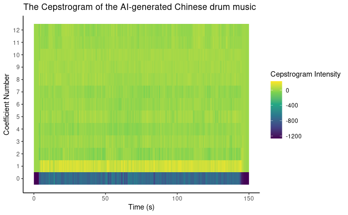
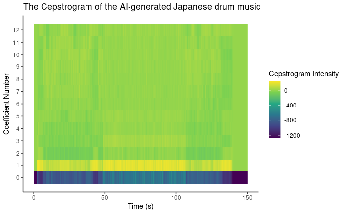

Column
-------------------------------------------------------------------

When analyzing loudness, one of the big drawbacks of the music generated by the AI was that the AI didn't reveal which instruments it used or at least mimicked to produce this audio. Moreover, the AI also didn't generate any sheet music therefore no dynamics hints can be found. However, I can still analyze the loudness with the help of Chromagram and Cepstrogram.

In contrast to the messy energy distribution of the Chinese Chromagram, the Japanese Chromagram is more regular. Specifically, from 0-50 seconds, a cyclic rise from E to GAB can be observed in the Chromagram, where the power is concentrated in the wider pitch classes E and B with bright yellow lines, suggesting that the drummer pushes harder in the first minute on the pitch classes B and E. 
In the second minute, there is a fast, hard beat in the audio, which can be seen in both the Chromagram and the Cepstrogram. In the Chromagram, the power in the second minute is more evenly distributed across all the pitch classes, which suggests that the drums are vibrating strongly, generating many harmonics. This can be confirmed by the Cepstrogram since the horizontal bars in the Cepstrogram with a Coefficient Number of 1 are the brightest in the second minute, and the bars corresponding to higher Coefficient Numbers become brighter than in the first and third minutes, indicating that the song is the loudest in the second minute. By the third minute, the audio is winding down, and the loudness of the audio is decreasing, but there is still a very hard finish before the sound completely fades away to give the performance more richness and flexibility, which can be seen in the concentration of the Chromagram's power in the pitch classE towards the end of the 150 second mark, as well as in the bright yellow color of the Cepstrogram's closing section.

The AI-generated Japanese drums do a very good job of distributing the intensity, as this distribution of intensity is generally in line with Japanese drumming conventions, especially a fast-paced, hard-hitting section in the middle of a piece.According to Yan and Pu (1997), this distinctive playing convention is a common technique for drummers to show off their drumming skills in performances, where the hammers are lifted and dropped quickly and forcefully, like a rain shower. Therefore, AI successfully mimics the distribution of force in the performance of Japanese drummers.

The Chinese Chromagram and Cepstrogram are cluttered compared to the Japanese. In the Chromagram, it is barely noticeable that the drummer's power is concentrated in pitch classes B and E. Throughout the three minutes, there is a distribution of energy in each of the pitch calss from E to B, suggesting that the drummer has been playing the music with the same kind of power, which is also evident in the Cepstrogram: throughout the three minutes, the horizontal stripes corresponding to a Coefficient Number of 1 are less bright than Japan, and there is no obvious change in color, which suggests that the dynamic and loudness in Chinese drumming is stable and lack of variation. This explains why this AI-generated music was called boring and uninspiring in the peer review. However, real Chinese drum music is very rich in rhythm, intensity, and timbral variation, according to Yan and Pu (1997). Therefore, this AI-generated music is not in line with the performance characteristics of Chinese drum music in terms of intensity distribution.

So why hasn't AI learned about the playing habits of Chinese drumming in terms of intensity? This may be due to some cultural reasons. Chinese drum music is roughly divided into two categories: royal drum music and folk drum music. according to Yan and Pu (1997), royal drum music deliberately pursues instability in pitch and intensity to create an unfathomably majestic and magical sense of kingship, and this kind of unstable pitch and intensity is very difficult for AIs to interpret and learn correctly. In addition, according to Yan and Pu (1997), the intensity of folkloric drumming is very skillful, but the drummers often come from lowly backgrounds and are not highly regarded, so there are no written or audio records of their playing techniques and habits, and therefore there are not enough useful sources for AIs to learn, which may result in AIs' lack of understanding of Chinese drumming habits.

Reference 

Yan, C., & Pu, H. (1997). Zhongguo Guwenhua Yanjiu [Research on Chinese Drum Culture]. Guangxi Education Press.

Timbre features[timbre]
======================================================================

Column
---------------------------------------------------------------------
### Timbre features [timbre]

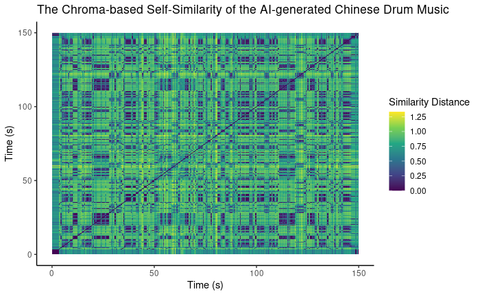
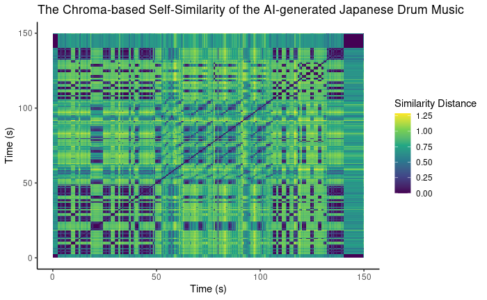
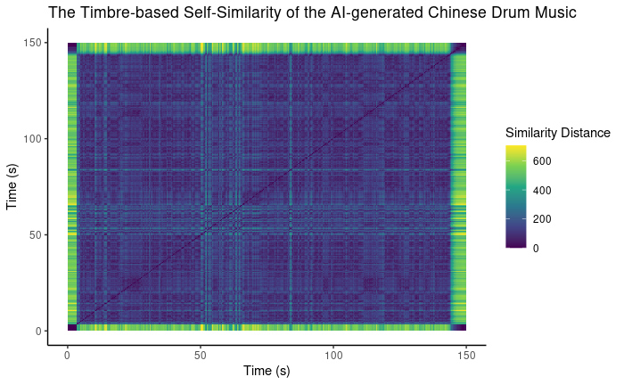
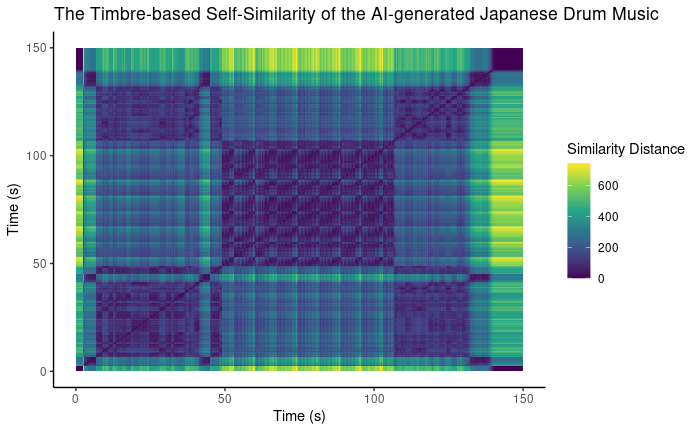

Column
--------------------------------------------------------------------
The AI-generated Chinese music mentioned on the previous page is boring because of its lack of variation. My question is whether this lack of variation also reflected in the timbre? This can be clearly observed with The Timbre-based Self-Similarly. The image consists of four yellow lines close to the edges (representing high similarity distance) and dark blue (representing low similarity distance) internally, which indicates that except for the silence at the beginning and end of the audio, the entire song is very similar in terms of timbre, since there is a very close similarity distance at any given time.

Additionally, a change in color can be seen after the 50th and 80th seconds, which represents a change in timbre, possibly due to a change in instrumentation, as it can be heard in the audio that it is played by a stringed instrument up until the 50th second, whereas after the 50th second there is a brief appearance of drums and cymbals, and then a repetition of the stringed instrument, with the same intensity and tempo. It is then interrupted by a brief cymbal sound at the 80th second. 
It can be assumed that it is the distinctive timbre of this stringed instrument, played slowly from beginning to end, that contributes to homogeneous timbre of this music.

The Chroma-based Self-Similarity of Chinese music also confirms this finding. In the whole three minutes, a lot of blue blocks can be observed, which means that the pitch of this piece of music is very homogeneous without much variation. Similarly, the yellow lines at 50th and 80th seconds represent sudden changes in pitch, probably due to the sudden appearance of the cymbal, an instrument with an unstable pitch.

 This reflects one of the drawbacks of AI-generated audio: the user does not have full control over which instruments the AI is able to use, and the prolonged reappearance of certain instruments can make the music too homogeneous and lacking in variation and novelty. By contrast, real people can have more creativity and freedom when they create their own music.

Moreover, the excellence of the AI in generating Japanese music can also be observed in the self-similarity. Firstly, in the Chroma-based Self-Similarity, it can be seen that the pitch of the music is internally homogeneous in the second minute, but it is different from the first minute and the third minute. In addition, it can be seen that the ending part of the music is homogeneous homogenized with the beginning part, which makes the music more structured and complete. In the Timbre-based Self-Similarity, the dark blue block in the second minute of the music suggests that the timbre of the second minute is different from the rest of the piece. However, the four big blue blocks at the edges of the picture indicate that the music is very homogeneous in the first and third minutes. Compared to the Chinese music, the AI-generated Japanese music is more diverse and varied in both pitch and timbre. This may still be due to the fact that there is less Chinese music audio available for training the AI or it is more difficult to recognize.

Temporal Features[duration]
=====================================================================

Column
--------------------------------------------------------------------

### Temporal features [duration]

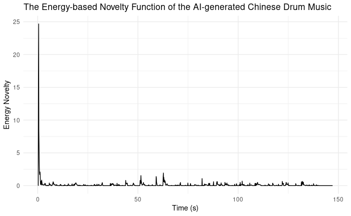
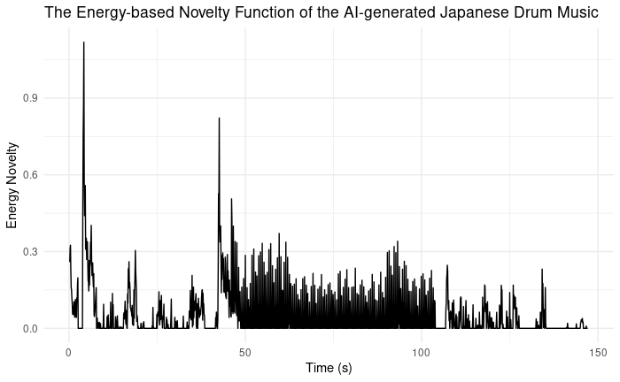
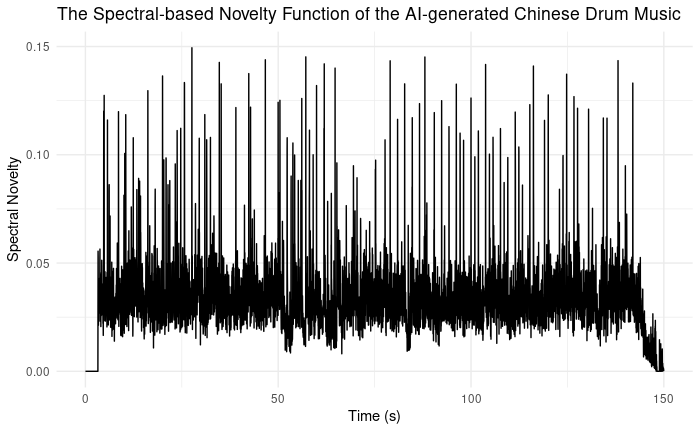
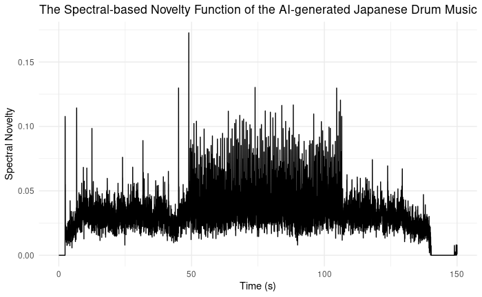
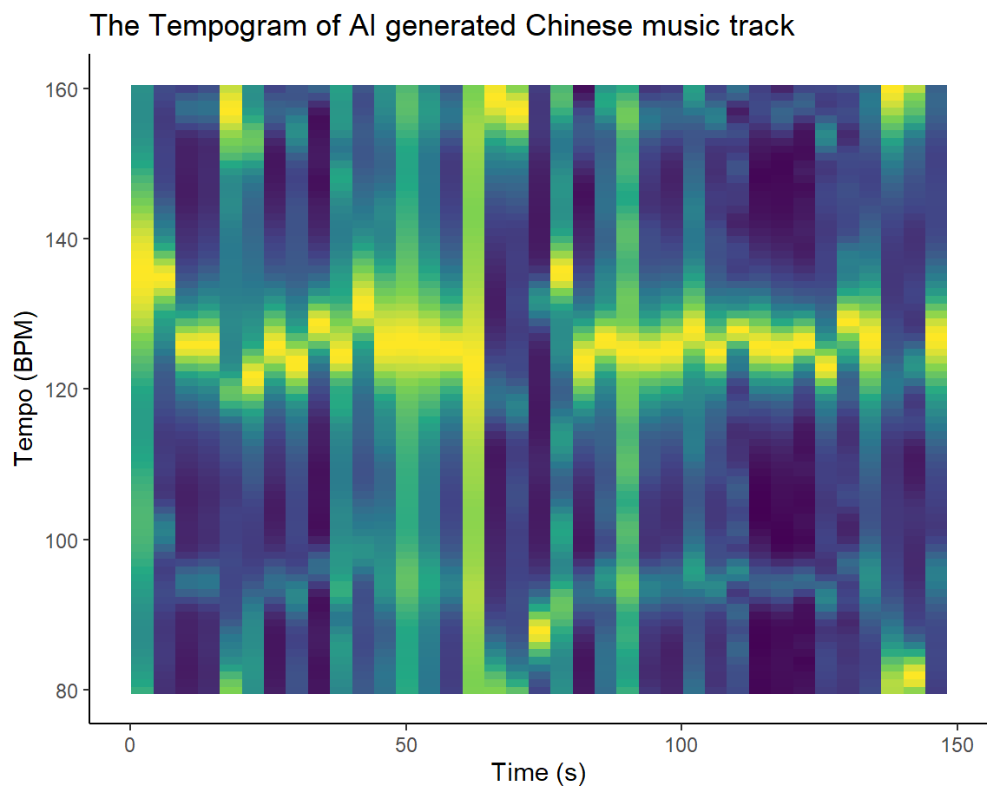
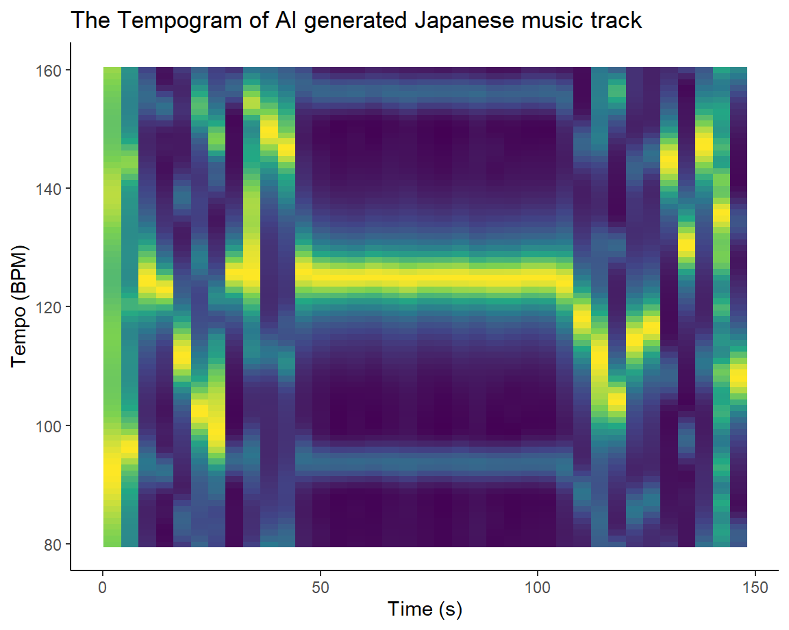

Column
-------------------------------------------------------------------
As I found in the quantified features, the AI generated Chinese music has low arousal and engagingness. In other words, this music track makes people sleepy instead of excited. This visualization of the Energy-based Novelty Function also confirms this. In this plot, it can be found that it is difficult to detect note onsets based on changes in loudness due to the fact that there is no significant change in the loudness of the song, which remains the same throughout the song. More importantly, the loudness of the entire song is very low. For example, although the energy-based Novelty Function successfully detects the drum and cymbal onsets at 50 and 80 seconds, the energy of these two peaks is less than 5, which implies low loudness. 

This result is very disappointing because the low-loudness drum music generated by the AI does not conform to the most distinctive feature of traditional Chinese drum music which is high loudness, for example, in some occasions the drum need to be loud enough to hide the sound of other instruments, according to Yan and Pu ( 1997).

The AI-generated Japanese music is still more satisfactory compared to the Chinese music. In the visualization of Energy-based Novelty Function, the start time of each drum beat in the second minute is clearly visible. Moreover, the loudness of the drums in the second minute is higher than that of the orchestral sounds in the first and third minutes, which suggests that the AI-generated Japanese music is more in line with the characteristics of high-loudness drums.

Moreover,in the visualization of the Spectral-based Novelty Function, it can be seen that the starting points of the beats are relatively close to each other, without much variation, which means that the beat of this music is relatively homogeneous, without variety or much change. It is also worth noting that the string instrument, which can be heard throughout the music, has a vibrato that leads to a blurring of the beat start positions, according to Müller (2021). This is also disappointing, perhaps the AI added a whole string instrument to set off the drums, however in reality this instrument does nothing but make the actual beat start of the drums difficult to see.

In fact, the Japanese music created by the AI has this same problem, because as can be heard in the audio, there is a flute sound in both the first and third minutes, so the flute vibrato creates a lot of black shading, and the only thing that can be observed from the visualization of the Spectral-based Novelty Function is that the beat of the drums is faster than the beat of the flutes in the second and third minutes because the Novelty Function peaks are closer to each other in the second minute. But if the AI generates a piece of music with only drums as instruments according to my prompts, then the start of the beat is clearer.

In order to overcome the blurred black shadows caused by these vibrato sounds, I chose to use a Tempogram, because in a Tempogram, the Tempo (BPM) values of each part of the music can be clearly observed.

 In the Tempogram of the AI generated Japanese music track, you can see that in the first and third minutes, the flute changes its tempo constantly, but the duration of each tempo is very short. In the second minute, the tempo of the drums can be seen to stabilize at 120 BPM. the AI's assignment of Tempo for this track is very satisfying to me because the contrast between the unstable and variable tempo of the flute and the stable tempo of the drums makes the music sound very interesting.

But in the AI-generated Chinese music, the assignment of tempo is very unsatisfactory. Unlike the minute-long drums in the Japanese music, the real drums only appear very briefly at 50 and 80 minutes and are mixed with the rhythm-less cymbals, which makes it very difficult to make out the tempo of the drums in the graphs, which maintain a tempo of between 120 BPM all due to that steady stringed instrument. This shows that the AI didn't do what my prompts said at all, instead of assigning a steady tempo and enough playing time to the drums, the AI turned the piece into a solo for the stringed instrument, with two sporadic drum sounds. The only good thing about this piece of music is that compared to Japanese music, where the tempo is unstable and has no clear cyclical pattern in the first and third minutes, Chinese music has a basically stable tempo, spreading from the beginning to the end of the music all around 120 BPM.

Reference 

Müller, M. (2021). Fundamentals of music processing : using Python and Jupyter notebooks (Second edition.). Springer.

Yan, C., & Pu, H. (1997). Zhongguo Guwenhua Yanjiu [Research on Chinese Drum Culture]. Guangxi Education Press.

Clustering
=====================================================================

Column
---------------------------------------------------------------------
### Clustering

Column
----------------------------------------------------------

Conclusion and Contribution
=======================================================

Column
--------------------------------------------------------

