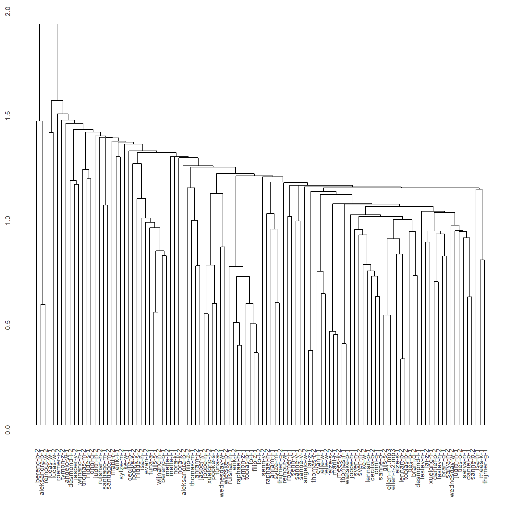
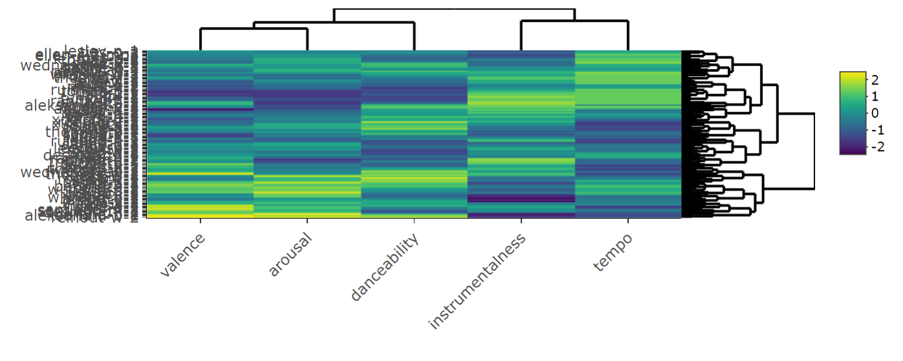

### Background and Research Questions

For people without any basic knowledge of programming or artificial intelligence, interacting with an AI is a magical thing in itself, 
and these people often have no way of recognizing the quality of the content generated by the AI, and take it all as correct and unquestionable. 
This phenomenon maybe due to the fact that the AI seems to be so obedient that no matter what complex or even absurd commands people type into the AI, 
the AI is able to try and type in a piece of content that seems to make sense. 
But while people get text, images, or audio generated by the AI too easily, 
they overlook the question of whether the content generated by the AI actually meets the requirements, rather than being a pile of empty nonsense that seems to be correct. 
That is to say, does the AI generated content really conform to the input prompts entered by the user? 
If the AI generated audio does not meet the user's requirements, how can the user recognize it?

In this portfolio, I will answer two research questions:
The first is whether AI-generated music actually meets the input prompts.
The second is which music visualization methods can help me identify whether AI-generated audio meets the input prompts.

As an Asian student, I have a strong appreciation for Chinese and Japanese music. 
However, I lack a formal music background, which makes it challenging for me to create my own compositions. 
To overcome this, I turned to artificial intelligence for assistance by using Stable Audio as the AI tool to generate music. 


First, I input prompts including Drum Kit, Flowing, Raw, Epic, Chinese Traditional Music, and Sentimental. 
The outcome is this piece: https://stableaudio.com/1/share/60e8141d-6ac9-4928-8bf2-0d6d6e420736.

This is the audio of the AI generated Chinese music track:

<div>
  <audio controls>
    <source src="ruishan-h-1.mp3" type="audio/mpeg">
    Your browser does not support the audio element.
  </audio>
</div>


Furthermore, I use prompts that included Drum Kit, Flowing, Raw, Epic, Japanese Traditional Music, and Sentimental, 
which resulted in this track: https://stableaudio.com/1/share/c8d896b9-e6ba-4646-a3bc-c81682f47011.

This is the audio of the AI generated Japanese music track:

<div>
  <audio controls>
    <source src="ruishan-h-2.mp3" type="audio/mpeg">
    Your browser does not support the audio element.
  </audio>
</div>


### Track-level features


```{r}

library(ggplot2)
library(tidyr)
library(dplyr)  # 用于 select 函数
library(tidyr)


# 读取数据
compmus_data <- read.csv("compmus2025.csv")

# 筛选出两个观察对象的数据
compmus_data_subset <- compmus_data[compmus_data$filename %in% c("ruishan-h-1", "ruishan-h-2"), ]

# 将数据转换为长格式
compmus_long <- pivot_longer(compmus_data_subset, 
                             cols = c(approachability, arousal, danceability, 
                                      engagingness, instrumentalness, tempo, valence),
                             names_to = "variable", 
                             values_to = "value")

# 选择班级数据
class_data <- compmus_data[compmus_data$filename != "ruishan-h-1" & compmus_data$filename != "ruishan-h-2", ]

# 将班级数据转换为长格式
class_data_long <- pivot_longer(class_data, 
                                cols = c(approachability, arousal, danceability, 
                                         engagingness, instrumentalness, tempo, valence),
                                names_to = "variable", 
                                values_to = "value")

# 绘制密度图，显示班级数据和两条虚线
ggplot(class_data_long, aes(x = value, fill = variable)) +
  geom_density(alpha = 0.5) +  # 班级数据的密度图
  geom_vline(data = compmus_long[compmus_long$filename == "ruishan-h-1", ], 
             aes(xintercept = value), color = "blue", linetype = "dashed", size = 1) +  # 为 ruishan-h-1 添加虚线
  geom_vline(data = compmus_long[compmus_long$filename == "ruishan-h-2", ], 
             aes(xintercept = value), color = "red", linetype = "dashed", size = 1) +  # 为 ruishan-h-2 添加虚线
  theme_minimal() +
  labs(title = "the musical attributes distribution in class courpus",
       x = "Variable Value",  
       y = "Density (Probability Distribution)",  
       caption = "Blue line represents AI Generated Chinese music, Red line represents AI generated Japanese music") +  # 添加标题和注释
  facet_wrap(~ variable, scales = "free") +  # 分面图
  theme(legend.position = "none",  
        plot.caption = element_text(hjust = 0.5, color = "black", size = 10))  # 注释居中


```


### Chroma features [pitch]

{width=45%}
{width=45%}

```{r}

library(tidyverse)
source("compmus.R")

"features/ruishan-h-1.json" |>                           # Change the track
  compmus_chroma(norm = "identity") |>                 # Change the norm
  ggplot(aes(x = time, y = pc, fill = value)) + 
  geom_raster() +
  scale_y_continuous(
    breaks = 0:11,
    minor_breaks = NULL,
    labels = c(
                "C", "C#|Db", "D", "D#|Eb",
                "E", "F", "F#|Gb", "G",
                "G#|Ab", "A", "A#|Bb", "B"
              )
  ) +
  scale_fill_viridis_c(guide = "none") +               # Change the colours?
  labs(x = "Time (s)", y = NULL, fill = NULL) +
  theme_classic()                                      # Change the theme?


```


`


```


hello

### Loudness [volume]


```{r}


"features/ruishan-h-2.json" |>                           # Change the track
  compmus_chroma(norm = "identity") |>                 # Change the norm
  ggplot(aes(x = time, y = pc, fill = value)) + 
  geom_raster() +
  scale_y_continuous(
    breaks = 0:11,
    minor_breaks = NULL,
    labels = c(
                "C", "C#|Db", "D", "D#|Eb",
                "E", "F", "F#|Gb", "G",
                "G#|Ab", "A", "A#|Bb", "B"
              )
  ) +
  scale_fill_viridis_c(guide = "none") +               # Change the colours?
  labs(x = "Time (s)", y = NULL, fill = NULL) +
  theme_classic()                                      # Change the theme?


```


### Timbre features [timbre]

```{r}
#      C     C#    D     Eb    E     F     F#    G     Ab    A     Bb    B
major_chord <-
  c(   1,    0,    0,    0,    1,    0,    0,    1,    0,    0,    0,    0)
minor_chord <-
  c(   1,    0,    0,    1,    0,    0,    0,    1,    0,    0,    0,    0)
seventh_chord <-
  c(   1,    0,    0,    0,    1,    0,    0,    1,    0,    0,    1,    0)

major_key <-
  c(6.35, 2.23, 3.48, 2.33, 4.38, 4.09, 2.52, 5.19, 2.39, 3.66, 2.29, 2.88)
minor_key <-
  c(6.33, 2.68, 3.52, 5.38, 2.60, 3.53, 2.54, 4.75, 3.98, 2.69, 3.34, 3.17)

chord_templates <-
  tribble(
    ~name, ~template,
    "Gb:7", circshift(seventh_chord, 6),
    "Gb:maj", circshift(major_chord, 6),
    "Bb:min", circshift(minor_chord, 10),
    "Db:maj", circshift(major_chord, 1),
    "F:min", circshift(minor_chord, 5),
    "Ab:7", circshift(seventh_chord, 8),
    "Ab:maj", circshift(major_chord, 8),
    "C:min", circshift(minor_chord, 0),
    "Eb:7", circshift(seventh_chord, 3),
    "Eb:maj", circshift(major_chord, 3),
    "G:min", circshift(minor_chord, 7),
    "Bb:7", circshift(seventh_chord, 10),
    "Bb:maj", circshift(major_chord, 10),
    "D:min", circshift(minor_chord, 2),
    "F:7", circshift(seventh_chord, 5),
    "F:maj", circshift(major_chord, 5),
    "A:min", circshift(minor_chord, 9),
    "C:7", circshift(seventh_chord, 0),
    "C:maj", circshift(major_chord, 0),
    "E:min", circshift(minor_chord, 4),
    "G:7", circshift(seventh_chord, 7),
    "G:maj", circshift(major_chord, 7),
    "B:min", circshift(minor_chord, 11),
    "D:7", circshift(seventh_chord, 2),
    "D:maj", circshift(major_chord, 2),
    "F#:min", circshift(minor_chord, 6),
    "A:7", circshift(seventh_chord, 9),
    "A:maj", circshift(major_chord, 9),
    "C#:min", circshift(minor_chord, 1),
    "E:7", circshift(seventh_chord, 4),
    "E:maj", circshift(major_chord, 4),
    "G#:min", circshift(minor_chord, 8),
    "B:7", circshift(seventh_chord, 11),
    "B:maj", circshift(major_chord, 11),
    "D#:min", circshift(minor_chord, 3)
  )

key_templates <-
  tribble(
    ~name, ~template,
    "Gb:maj", circshift(major_key, 6),
    "Bb:min", circshift(minor_key, 10),
    "Db:maj", circshift(major_key, 1),
    "F:min", circshift(minor_key, 5),
    "Ab:maj", circshift(major_key, 8),
    "C:min", circshift(minor_key, 0),
    "Eb:maj", circshift(major_key, 3),
    "G:min", circshift(minor_key, 7),
    "Bb:maj", circshift(major_key, 10),
    "D:min", circshift(minor_key, 2),
    "F:maj", circshift(major_key, 5),
    "A:min", circshift(minor_key, 9),
    "C:maj", circshift(major_key, 0),
    "E:min", circshift(minor_key, 4),
    "G:maj", circshift(major_key, 7),
    "B:min", circshift(minor_key, 11),
    "D:maj", circshift(major_key, 2),
    "F#:min", circshift(minor_key, 6),
    "A:maj", circshift(major_key, 9),
    "C#:min", circshift(minor_key, 1),
    "E:maj", circshift(major_key, 4),
    "G#:min", circshift(minor_key, 8),
    "B:maj", circshift(major_key, 11),
    "D#:min", circshift(minor_key, 3)
  )
library(tidyverse)
source("compmus.R")

"features/ruishan-h-1.json" |> 
  compmus_chroma(norm = "identity") |> 
  compmus_match_pitch_templates(
    key_templates,         # Change to chord_templates if desired
    norm = "identity",       # Try different norms (and match it with what you used in `compmus_chroma`)
    distance = "cosine"   # Try different distance metrics
  ) |>
  ggplot(aes(x = time, y = name, fill = d)) + 
  geom_raster() +
  scale_fill_viridis_c(guide = "none") +               # Change the colours?
  labs(x = "Time (s)", y = "Template", fill = NULL) +
  ggtitle("The Chordogram of AI generated Chinese music track") +  
  theme_classic()                                      # Change the theme?


library(tidyverse)
source("compmus.R")

source("compmus.R")

"features/ruishan-h-2.json" |> 
  compmus_chroma(norm = "identity") |> 
  compmus_match_pitch_templates(
    key_templates,         # Change to chord_templates if desired
    norm = "identity",       # Try different norms (and match it with what you used in `compmus_chroma`)
    distance = "cosine"   # Try different distance metrics
  ) |>
  ggplot(aes(x = time, y = name, fill = d)) + 
  geom_raster() +
  scale_fill_viridis_c(guide = "none") +               # Change the colours?
  labs(x = "Time (s)", y = "Template", fill = NULL) +
  ggtitle("The Chordogram of AI generated Japanese music track") +  
  theme_classic()                                      # Change the theme?


```


### Temporal features [duration]


### Clustering

```{r}


library(tidyverse)

source("compmus.R")

library(signal)

"features/ruishan-h-1.json" |>
  compmus_energy_novelty() |> 
  ggplot(aes(t, novelty)) +
  geom_line() +
  theme_minimal() +
  labs(x = "Time (s)", y = "Energy Novelty")

"features/ruishan-h-1.json" |>
  compmus_energy_novelty() |> 
  ggplot(aes(t, novelty)) +
  geom_line() +
  theme_minimal() +
  ggtitle("The energy novelty of AI generated Chinese music track") +  
  labs(x = "Time (s)", y = "Energy Novelty")

"features/ruishan-h-2.json" |>
  compmus_energy_novelty() |> 
  ggplot(aes(t, novelty)) +
  geom_line() +
  theme_minimal() +
  ggtitle("The energy novelty of AI generated Japanese music track") +  
  labs(x = "Time (s)", y = "Energy Novelty")


"features/ruishan-h-1.json" |>
  compmus_spectral_novelty() |> 
  ggplot(aes(t, novelty)) +
  geom_line() +
  theme_minimal() +
  ggtitle("The spectral novelty of AI generated Chinese music track") +  
  labs(x = "Time (s)", y = "Spectral Novelty")


"features/ruishan-h-2.json" |>
  compmus_spectral_novelty() |> 
  ggplot(aes(t, novelty)) +
  geom_line() +
  theme_minimal() +
  ggtitle("The spectral novelty of AI generated Japanese music track") +  
  labs(x = "Time (s)", y = "Spectral Novelty")

"features/ruishan-h-1.json" |>
  compmus_tempogram(window_size = 4, hop_size = 4, cyclic = TRUE) |>
  ggplot(aes(x = time, y = bpm, fill = power)) +
  geom_raster() +
  scale_fill_viridis_c(guide = "none") +
  labs(x = "Time (s)", y = "Tempo (BPM)") +
  ggtitle("The Tempogram of AI generated Chinese music track") +  
  theme_classic()


"features/ruishan-h-2.json" |>
  compmus_tempogram(window_size = 4, hop_size = 4, cyclic = TRUE) |>
  ggplot(aes(x = time, y = bpm, fill = power)) +
  geom_raster() +
  scale_fill_viridis_c(guide = "none") +
  labs(x = "Time (s)", y = "Tempo (BPM)") +
  ggtitle("The Tempogram of AI generated Japanese music track") +  
  theme_classic()


```


### Contribution


```{r}


"features/ruishan-h-1.json" |>                           # 更换曲目
  compmus_chroma(norm = "identity") |>                 # 更换归一化方式
  ggplot(aes(x = time, y = pc, fill = value)) + 
  geom_raster() +
  scale_y_continuous(
    breaks = 0:11,
    minor_breaks = NULL,
    labels = c(
                "C", "C#|Db", "D", "D#|Eb",
                "E", "F", "F#|Gb", "G",
                "G#|Ab", "A", "A#|Bb", "B"
              )
  ) +
  scale_fill_gradient(low = "white", high = "black") +    # 低值为浅粉色，高值为红色
  labs(x = "Time (s)", y = NULL, fill = NULL) +
  ggtitle("The Chromagram of AI generated Chinese music track") +  
  theme_classic()                                      # 更改主题


"features/ruishan-h-2.json" |>                           # 更换曲目
  compmus_chroma(norm = "identity") |>                 # 更换归一化方式
  ggplot(aes(x = time, y = pc, fill = value)) + 
  geom_raster() +
  scale_y_continuous(
    breaks = 0:11,
    minor_breaks = NULL,
    labels = c(
                "C", "C#|Db", "D", "D#|Eb",
                "E", "F", "F#|Gb", "G",
                "G#|Ab", "A", "A#|Bb", "B"
              )
  ) +
  scale_fill_gradient(low = "white", high = "black") +    # 低值为浅粉色，高值为红色
  labs(x = "Time (s)", y = NULL, fill = NULL) +
  ggtitle("The Chromagram of AI generated Japanese music track") +  
  theme_classic()   


"features/ruishan-h-2.json" |>                    # 替换为你的音频文件
  compmus_chroma(norm = "chebyshev") |>         # 选择归Manhattan化方法，例如 "manhattan"
  ggplot(aes(x = time, y = pc, fill = value)) +
  geom_raster() +
  scale_y_continuous(
    breaks = 0:11,
    labels = c(
      "C", "C#|Db", "D", "D#|Eb",
      "E", "F", "F#|Gb", "G",
      "G#|Ab", "A", "A#|Bb", "B"
    )
  ) +
  scale_fill_gradient(low = "white", high = "black") +  
  labs(x = "Time (s)", y = "Pitch Class", fill = "Energy") +
  ggtitle("The Chromagram of AI generated Japanese music track") +  
  theme_classic()


"features/ruishan-h-1.json" |>                    # 替换为你的音频文件
  compmus_chroma(norm = "chebyshev") |>         # 选择归Manhattan化方法，例如 "manhattan"
  ggplot(aes(x = time, y = pc, fill = value)) +
  geom_raster() +
  scale_y_continuous(
    breaks = 0:11,
    labels = c(
      "C", "C#|Db", "D", "D#|Eb",
      "E", "F", "F#|Gb", "G",
      "G#|Ab", "A", "A#|Bb", "B"
    )
  ) +
  scale_fill_gradient(low = "white", high = "black") +  
  labs(x = "Time (s)", y = "Pitch Class", fill = "Energy") +
  ggtitle("The Chromagram of AI generated Chinese music track") +  
  theme_classic()


"features/ruishan-h-1.json" |>                           # Change the track
  compmus_mfccs(norm = "identity") |>                  # Change the norm
  ggplot(aes(x = time, y = mfcc, fill = value)) + 
  geom_raster() +
  scale_y_continuous(
    breaks = 0:12,
    minor_breaks = NULL,
  ) +
  scale_fill_viridis_c(guide = "none") +               # Change the colours?
  labs(x = "Time (s)", y = "Coefficient Number", fill = NULL) +
  ggtitle("The Cepstrogram of AI generated Chinese music track") +  
  theme_classic()          


"features/ruishan-h-2.json" |>                           # Change the track
  compmus_mfccs(norm = "identity") |>                  # Change the norm
  ggplot(aes(x = time, y = mfcc, fill = value)) + 
  geom_raster() +
  scale_y_continuous(
    breaks = 0:12,
    minor_breaks = NULL,
  ) +
  scale_fill_viridis_c(guide = "none") +               # Change the colours?
  labs(x = "Time (s)", y = "Coefficient Number", fill = NULL) +
  ggtitle("The Cepstrogram of AI generated Japanese music track") +  
  theme_classic()   

```


